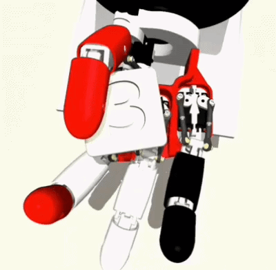
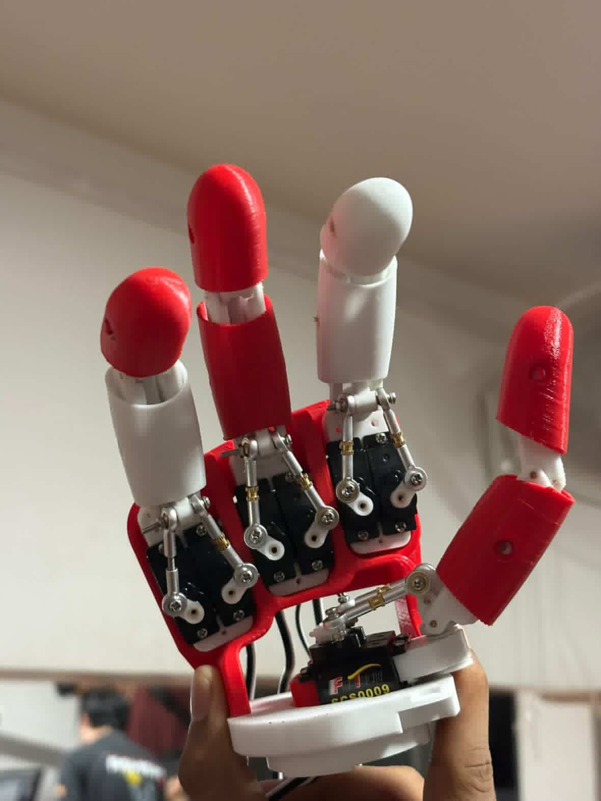

# AmazeDex

Training a multi-fingered robotic hand to autonomously rotate a cube to any target orientation using deep reinforcement learning, on the **Amazing Hand** by [Pollen Robotics](https://github.com/pollen-robotics/AmazingHand/) (4 fingers, 8 DOF).

<p align="center">
  
</p>

Trained fully in **MuJoCo** simulation, deployed to real hardware using AprilTag-based pose estimation. Best result: **~80% success rate** with SAC.

---

## Overview

The robot receives information about the object's current orientation and target orientation and learns finger movements that gradually align the object with the target pose. The training is performed entirely in a simulated environment, where the agent learns through trial and error by maximizing rewards based on orientation accuracy and grasp stability.

This project is a union of mechanical design, computer vision, and reinforcement learning to achieve dexterity — highlighting the challenges of controlling multi-finger robotic systems for complex in-hand manipulation and deploying it on real hardware.

---

## Repository Map

```text
AmazeDex/
├── assets/                         # Media assets (images and GIFs) for documentation
├── RLPractice/                     # RL fundamentals and toy environments
├── mjcf/                           # MuJoCo physical model assets & scene definitions
├── rockpaperscissors/              # Sim2real gesture recognition mini-task
└── src/                            # Core dexterous manipulation pipeline
```

## Simulation & Hardware

### Simulation
The Amazing Hand is a four-fingered hand with 8 degrees of freedom (DOF). It was simulated and trained in **MuJoCo**, chosen for being lightweight, easy to work with, and good at representing real-world physical parameters.

Two XML files define the simulation:
- **`robot.xml`**: Defines joint kinematics, motor actuators, control limits, applied forces, and physical inertia.
- **`scene.xml`**: Environment configuration including ground surface plane, lighting, cameras, and target cube dynamics.

STL models were sourced from Onshape / Pollen Robotics and converted to MuJoCo XML using [`onshape-to-robot`](https://github.com/rhoban/onshape-to-robot). Since no open-source stand existed, a custom mechanical mounting stand was modeled and 3D printed.

<p align="center">
  
</p>

### Hardware
- **Material:** All 3D-printed components fabricated in PLA filament.
- **Fasteners:** M2 screws (4–26 mm length), M2 hex nuts, 16 mm / 8 mm dowel pins per finger joint.
- **Stand:** Printed in two sections (base + hand-holder) joined via M3 fasteners.

<p align="center">
  
</p>


## Usage & Installation

### Prerequisites

This project utilizes [`uv`](https://github.com/astral-sh/uv) for fast, deterministic Python environment management. Install `uv` using one of the commands below:

- **Linux / macOS:**
  ```bash
  curl -LsSf [https://astral.sh/uv/install.sh](https://astral.sh/uv/install.sh) | sh
  ```
- **Windows:**
  ```powershell
  powershell -c "irm [https://astral.sh/uv/install.ps1](https://astral.sh/uv/install.ps1) | iex"
  ```
- **Via pip:**
  ```bash
  pip install uv
  ```

---

### Execution Steps

1. **Clone the repository and install dependencies:**
   ```bash
   git clone https://github.com/OMSONTAKKE003/AmazeDex.git
   cd AmazeDex
   uv sync
   ```

2. **Train the cube-rotation policy in simulation:**
   ```bash
   uv run src/training/train_ppo_cube.py
   ```
   *(Environment is registered via `src/envs/register_amazedex_env.py`)*

3. **Deploy trained policy to real hardware:**
   ```bash
   uv run src/deployment/deploy.py
   ```
   *(Uses AprilTag pose estimation from `src/perception/aruco_pose.py` to read object pose)*

4. **Run Rock-Paper-Scissors sim2real task:**
   ```bash
   uv run rockpaperscissors/train_ppo_rps.py   # Train in simulation
   uv run rockpaperscissors/sim2real_rps.py    # Deploy on hardware with vision input
   ```

5. **Run RL baseline practice scripts:**
   ```bash
   uv run RLPractice/FrozenLake.py
   ```

---

## Contributors

- [**Luv Bharat Jain**](https://github.com/luvjain22307-hue)
- [**Om Sontakke**](https://github.com/OMSONTAKKE003)

---

## Acknowledgements

Built under the **Society of Robotics and Automation (SRA), VJTI**, with guidance from mentors **Arhan Chavare** and **Sahil Apage**.

Hand hardware design based on the open-source **Amazing Hand** by [Pollen Robotics](https://www.pollen-robotics.com/).

