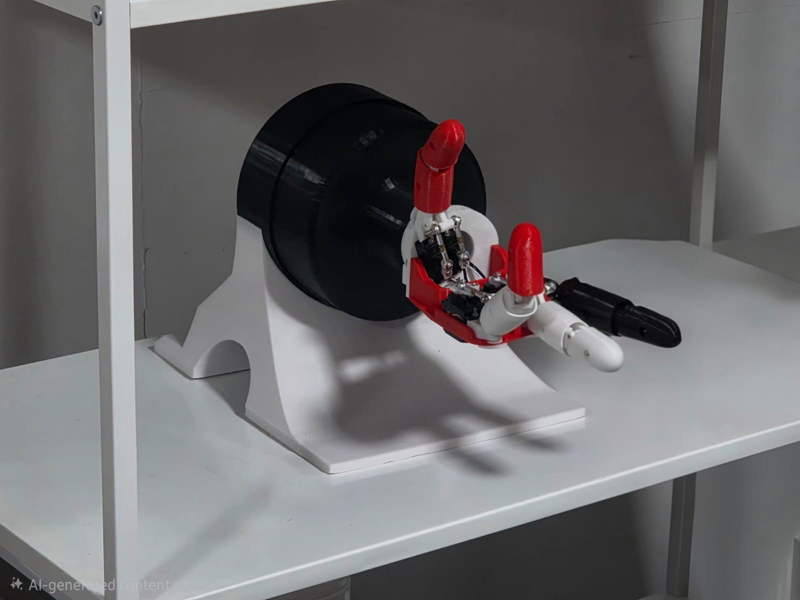
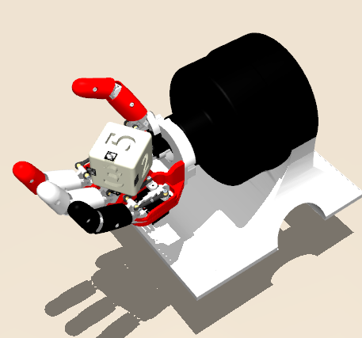
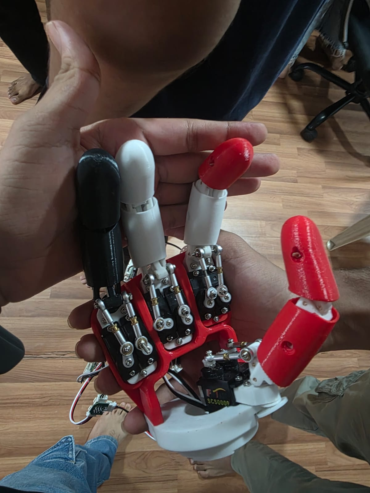
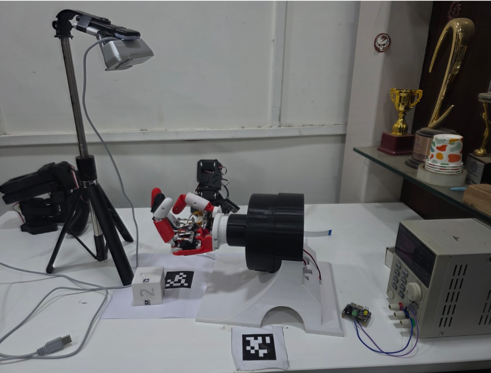
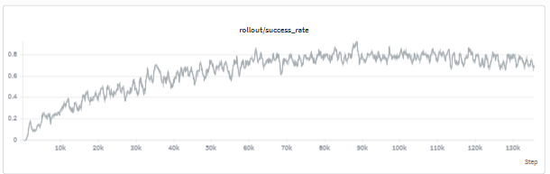

# 🤖 AmazeDex

Training a multi-fingered robotic hand to autonomously rotate a cube to any target orientation using deep reinforcement learning, on the **Amazing Hand** by [Pollen Robotics](https://github.com/pollen-robotics/AmazingHand/) (4 fingers, 8 DOF).

<p align="center">
  
</p>

Trained fully in **MuJoCo** simulation, deployed to real hardware using AprilTag-based pose estimation. Best result: **~80% success rate** with SAC.

---

## 📂 Repository Map

```
AmazeDex/
│
├── RLPractice/                     # RL fundamentals — toy environments
│   ├── FrozenLake.py
│   ├── TemporalDifference.py
│   ├── acrobot.py
│   ├── mountaincar.py
│   └── pendulumcontinuous.py
│
├── resources/                      # MuJoCo assets
│   ├── assets/                     # STL files
│   ├── robot.xml                   # Hand structure, joints, actuators
│   ├── scene.xml                   # Full scene — hand + cube + stand
│   ├── rock.xml                    # Hand + stand only
│   ├── joints_properties.xml
│   └── tag36h11_XX.png             # AprilTags for cube faces
│
├── rockpaperscissors/               # Sim2real mini-task
│   ├── amazedex_rps_env.py
│   ├── mediapipe_rps_gesture.py
│   ├── mujoco_env.py
│   ├── sim2real_rps.py
│   └── train_ppo_rps.py
│
├── src/                              # Core dextrous manipulation pipeline
│   ├── deployment/
│   │   └── simreal.py               # Real-hardware deployment
│   ├── envs/
│   │   ├── amazedex_cube_env.py
│   │   ├── mujoco_env.py
│   │   └── register_amazedex_env.py
│   ├── perception/
│   │   └── aruco_pose.py            # AprilTag / pose estimation
│   └── training/
│       └── train_ppo_cube.py
│
├── testers/                          # Test scripts
├── pyproject.toml
└── uv.lock
```

---

## 🧠 Overview

The robot receives information about the object's current orientation and target orientation and learns finger movements that gradually align the object with the target pose. The training is performed entirely in a simulated environment, where the agent learns through trial and error by maximizing rewards based on orientation accuracy and grasp stability.

This project is a union of mechanical design, computer vision, and reinforcement learning to achieve dexterity — highlighting the challenges of controlling multi-finger robotic systems for complex in-hand manipulation and deploying it on real hardware.

---

## 🖥️ Simulation

The Amazing Hand is a four-fingered hand with 8 degrees of freedom (DOF). It was simulated and trained in **MuJoCo**, chosen for being lightweight, easy to work with, and good at representing real-world physical parameters.

Two XML files define the simulation:
- **`robot.xml`** — the hand's structure: joints, actuators, control ranges, forces, colors, and physical properties
- **`scene.xml`** — the environment: ground, camera, lighting, and the manipulation cube

STL files for the hand were sourced from Onshape and Pollen Robotics' GitHub, then converted to MuJoCo XML using the open-source [`onshape-to-robot`](https://github.com/rhoban/onshape-to-robot) tool. Since no open-source stand existed to hold the hand fixed in position, a custom mechanical stand was designed and 3D printed.

<p align="center">
  
</p>

---

## 🔧 Hardware

The physical hand is a replica of the original Amazing Hand by Pollen Robotics.

- **Material:** All 3D-printed parts in PLA filament
- **Fasteners:** M2 screws (4–26 mm), M2 hex nuts, 16 mm / 8 mm dowel pins per finger

- **Stand:** Printed in two sections (base + hand-holder), joined with M3 screws

<p align="center">
  
</p>

**Challenges encountered:**

| Issue | Details |
|---|---|
| Finger gimbal snapping | Broke repeatedly despite trying different print settings and filaments |
| Servo adapter failures | Suspected cause: inductive back-EMF surge — when a servo suddenly stops or jams, energy stored in its motor windings discharges as a voltage spike back into the adapter's power rail |
| Slower real-world motion | Servo speeds were intentionally limited to protect the hardware, making real movement slower than in simulation |

---

## 📷 Sim2Real Pose Estimation

In simulation, the cube's orientation comes directly from MuJoCo's ground truth — this isn't available in the real world, so a way to estimate the cube's 6D pose from a camera was needed.

Options considered: NVIDIA **DOPE**, **MegaPose6D**, and classical **OpenCV + PnP solver**. All of these were expected to struggle with occlusion and inconsistent lighting, so **AprilTags** fixed to each cube face were used instead for a simpler, more robust solution.

<p align="center">
  
</p>

---

## 🎯 Forms of Dextrous Manipulation

Two manipulation strategies were tried:

1. **Lift and rotate** — lift the cube off the palm, then rotate it about its spawn axis.
   ❌ The hand grasped the cube but often stayed idle instead of rotating it (a form of reward hacking), and struggled to lift the cube off the palm.

2. **Rotate to target face** — rotate the cube in place toward a user-specified target face.
   ✅ This gave much better results and became the main approach for the rest of the project.

---

## 🏋️ Training

Four reinforcement learning algorithms were tried, in this order:

1. **PPO (Proximal Policy Optimization)** — a common, stable starting point for continuous-control tasks. It worked for basic manipulation, but was slow to train and prone to reward hacking.
2. **PPO + Curriculum Learning** — gradually increased task difficulty. The hand learned to grasp the cube, but this exposed the reward hacking issue more clearly (grasping without rotating), so this approach was dropped.
3. **DDPG + HER (Hindsight Experience Replay)** — HER lets the agent learn from failed attempts by relabeling them with the goal actually achieved. This helped with sparse rewards, but the combination still struggled with the complexity of dexterous contact dynamics.
4. **SAC (Soft Actor-Critic)** — the best performer. SAC is off-policy, reuses past experience through a replay buffer, and uses entropy-driven exploration to try out different finger-coordination strategies instead of settling too early on one behavior.

**Algorithm comparison:**

| Algorithm | Success Rate (Convergence) | Main Issue |
|---|---|---|
| PPO | 0% | No success observed |
| PPO + Curriculum | Low (2–6%) | Grasp-and-idle (reward hacking) |
| DDPG + HER | 0% | Becomes idle after some steps |
| **SAC** | **~80%** | — |

**Key tuning changes that drove the biggest improvement:**
1. Reduced cube size to 48 mm, added a 4 mm edge fillet, reduced mass, and adjusted the initial spawn position
2. Increased push reward: `0.15 → 0.50`
3. Increased reach reward: `0.05 → 0.10`
4. Reweighted the success bonus (`26 → 16`) and drop penalty (`5.1 → 2.0`)
5. Fixed the start face instead of randomizing both start and target faces, cutting the number of combinations the model had to learn from 36 down to a manageable set

<p align="center">
  
</p>

---

## 🚀 Usage
 
**1. Install dependencies** (this repo uses [`uv`](https://github.com/astral-sh/uv) for dependency management):
 
```bash
git clone https://github.com/<your-org>/AmazeDex.git
cd AmazeDex
uv sync
```
 
**2. Train the cube-rotation policy in simulation:**
 
```bash
uv run src/training/train_ppo_cube.py
```
 
> The environment is registered via `src/envs/register_amazedex_env.py`; swap in your own RL algorithm/config here to reproduce the PPO / DDPG+HER / SAC comparisons described below.
 
**3. Deploy a trained policy to the real hand:**
 
```bash
uv run src/deployment/simreal.py
```
 
This uses AprilTag-based pose estimation (`src/perception/aruco_pose.py`) to read the cube's real-world orientation and feed it to the policy.
 
**4. (Optional) Try the rock-paper-scissors sim2real mini-task:**
 
```bash
uv run rockpaperscissors/train_ppo_rps.py   # train in sim
uv run rockpaperscissors/sim2real_rps.py    # deploy with webcam gesture input
```
 
**5. (Optional) Explore the RL fundamentals scripts:**
 
```bash
uv run RLPractice/FrozenLake.py
```
 
> Exact script arguments (checkpoint paths, number of episodes, etc.) are defined in each file — check the top of each script for configurable options.
 
---  


## 👥 Contributors

- **Luv Bharat Jain**
- **Om Sontakke**

---

## 🙏 Acknowledgements

Built under the **Society of Robotics and Automation, VJTI**, with guidance from mentors **Arhan Chavre** and **Sahil Apage**.

Hand design based on the open-source **Amazing Hand** by [Pollen Robotics](https://www.pollen-robotics.com/).