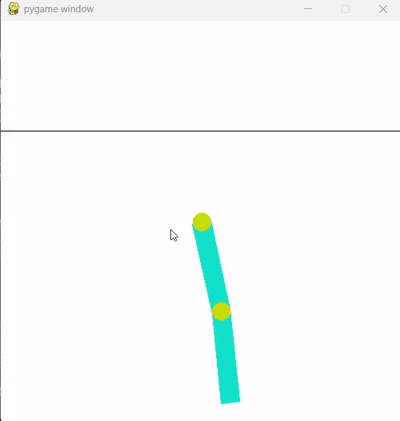
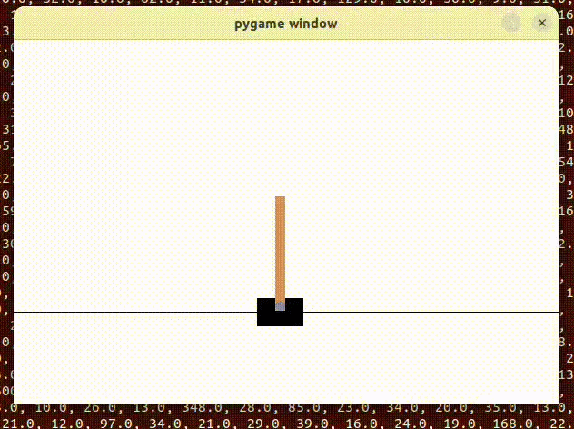
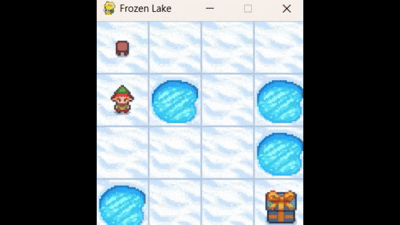
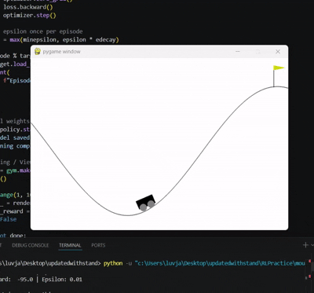
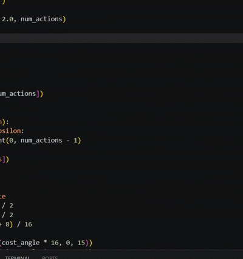
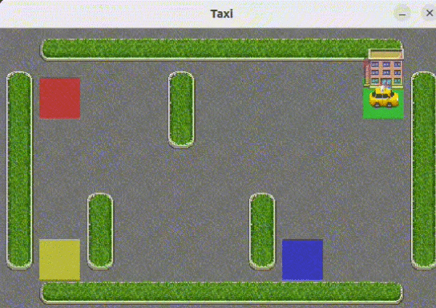

# Amaze Dex

This repository contains reinforcement learning practice scripts, environment specifications, and execution video demonstrations.

---

### **Acrobot**
* **Code:** `acrobot.py`
* **State Space:**
  * **Size:** Continuous (6 dimensions)
  * **Components:** $\cos(\theta_1)$, $\sin(\theta_1)$, $\cos(\theta_2)$, $\sin(\theta_2)$, angular velocity $\dot{\theta}_1$, angular velocity $\dot{\theta}_2$
* **Action Space:**
  * **Size:** 3 discrete actions
  * **Actions:** `0`: Apply -1 torque, `1`: Apply 0 torque, `2`: Apply +1 torque
* **Algorithm:** Deep Q-Network (DQN) / Value-based RL
* **Key Features:** Underactuated two-link robot swing-up task, -1 reward penalty for every step until reaching target height.
* **Demo:**  
  

---

### **CartPole**
* **Code:** `cartpole.py`
* **State Space:**
  * **Size:** Continuous (4 dimensions)
  * **Components:** Cart Position, Cart Velocity, Pole Angle, Pole Angular Velocity
* **Action Space:**
  * **Size:** 2 discrete actions
  * **Actions:** `0`: Push cart left, `1`: Push cart right
* **Algorithm:** Q-Learning
* **Key Features:** Classic inverted pendulum balancing, +1 reward per step for keeping pole upright within angular threshold.
* **Demo:**  
  

---

### **Frozen Lake**
* **Code:** `FrozenLake.py`
* **State Space:**
  * **Size:** 16 discrete states
  * **Components:** Grid positions $0$ to $15$ on a 4x4 grid
* **Action Space:**
  * **Size:** 4 discrete actions
  * **Actions:** `0`: Move Left, `1`: Move Down, `2`: Move Right, `3`: Move Up
* **Algorithm:** Value-Iteration
* **Key Features:** Stochastic state transitions (slippery ice), +1 reward for navigating safely to the goal without falling into holes.
* **Demo:**  
  

---

### **Mountain Car**
* **Code:** `mountaincar.py`
* **State Space:**
  * **Size:** Continuous (2 dimensions)
  * **Components:** Car Position $[-1.2, 0.6]$, Car Velocity $[-0.07, 0.07]$
* **Action Space:**
  * **Size:** 3 discrete actions
  * **Actions:** `0`: Accelerate left, `1`: Don't accelerate, `2`: Accelerate right
* **Algorithm:** DQN
* **Key Features:** Requires building momentum back-and-forth to overcome gravity, -1 step penalty until reaching goal flag.
* **Demo:**  
  

---

### **Pendulum (Continuous)**
* **Code:** `pendulumcontinuous.py`
* **State Space:**
  * **Size:** Continuous (3 dimensions)
  * **Components:** $\cos(\theta)$, $\sin(\theta)$, angular velocity $\dot{\theta}$
* **Action Space:**
  * **Size:** Continuous (1 dimension)
  * **Actions:** Joint torque constrained to $[-2.0, 2.0]$
* **Algorithm:** DQN
* **Key Features:** Continuous control swing-up task, quadratic cost penalizing angle offset, velocity, and effort.
* **Demo:**  
  

---

### **Taxi Driver**
* **Code:** `taxidriver.py`
* **State Space:**
  * **Size:** 500 discrete states
  * **Components:** Taxi position (25 grid cells), Passenger location (5 states), Destination location (4 states) [$25 \times 5 \times 4 = 500$]
* **Action Space:**
  * **Size:** 6 discrete actions
  * **Actions:** `0`: Move South, `1`: Move North, `2`: Move East, `3`: Move West, `4`: Pickup, `5`: Dropoff
* **Algorithm:** Q-Learning 
* **Key Features:** Bellman updates, $\epsilon$ decay over time, +20 reward for successful delivery, -10 penalty for illegal pickup/dropoff.
* **Demo:**  
  

---

### **Temporal Difference Learning**
* **Code:** `TemporalDifference.py`
* **State Space:**
  * **Size:** Environment-dependent discrete states
* **Action Space:**
  * **Size:** Discrete action set (e.g., directional movement)
* **Algorithm:** TD(0) 
* **Key Features:** Model-free RL, bootstrapping state values online without waiting for episode termination.